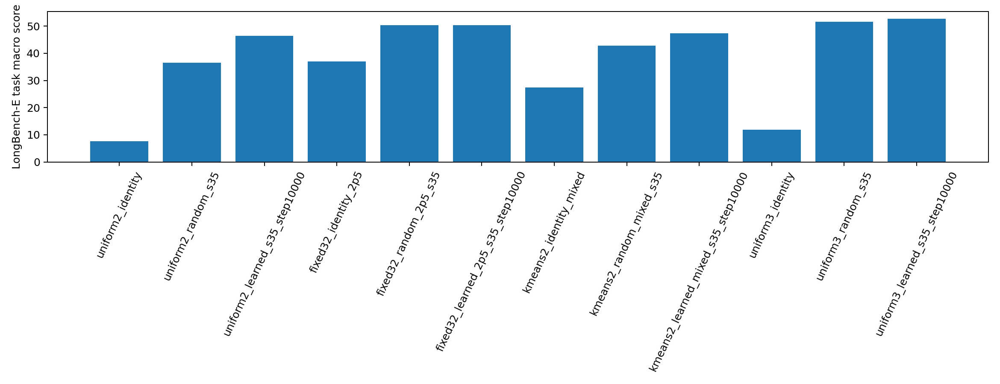
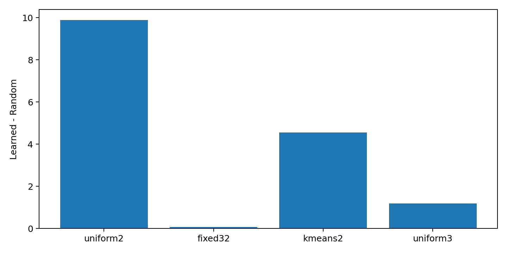
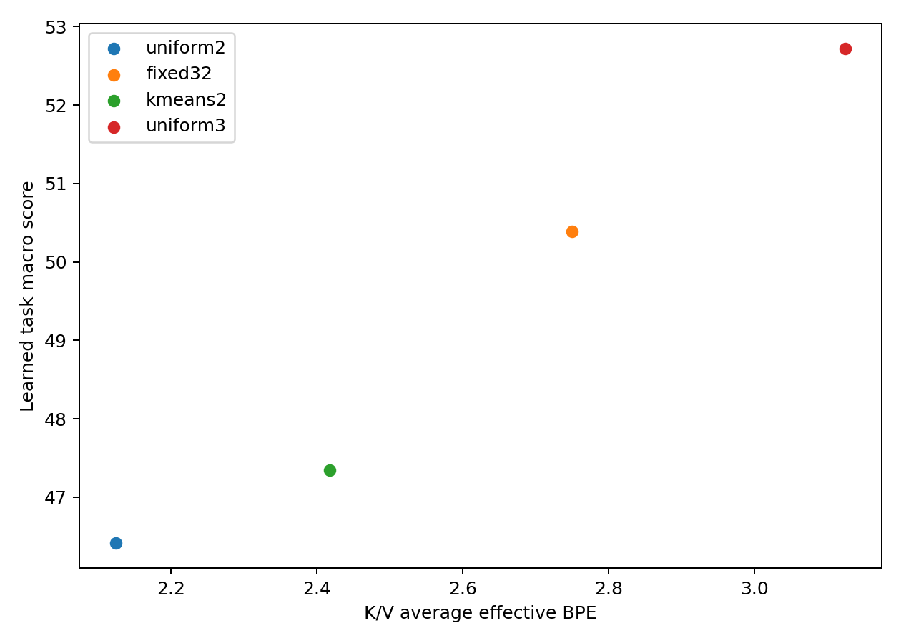

# LongBench-E channel allocation x rotation

- Scope: 20% task x length-bucket-stratified pilot (734 examples/condition).
- Conditions: 12 quantized K/V conditions; BF16 is not a primary condition.
- Learned means Learned Key / fixed Random Value.
- Cache path: reconstructed-BF16 quality emulation; storage is theoretical packed accounting.
- Bootstrap: 10,000 task-stratified paired example resamples, root seed 35.
- Prompt truncations: 0 of 8808 predictions.

## Condition scores

| Condition | Task macro | Equal-category macro | K/V effective BPE |
|---|---:|---:|---:|
| uniform2_identity | 7.555993 | 7.577411 | 2.125000 |
| uniform2_random_s35 | 36.516222 | 34.449165 | 2.125000 |
| uniform2_learned_s35_step10000 | 46.410449 | 44.772282 | 2.125000 |
| fixed32_identity_2p5 | 36.991472 | 34.865476 | 2.750000 |
| fixed32_random_2p5_s35 | 50.312709 | 48.819049 | 2.750000 |
| fixed32_learned_2p5_s35_step10000 | 50.386444 | 48.920628 | 2.750000 |
| kmeans2_identity_mixed | 27.349449 | 25.401454 | 2.417725 |
| kmeans2_random_mixed_s35 | 42.796269 | 41.129433 | 2.417725 |
| kmeans2_learned_mixed_s35_step10000 | 47.347570 | 45.618338 | 2.417725 |
| uniform3_identity | 11.824729 | 10.518322 | 3.125000 |
| uniform3_random_s35 | 51.542420 | 50.171910 | 3.125000 |
| uniform3_learned_s35_step10000 | 52.722674 | 51.370907 | 3.125000 |

## Storage accounting

| Allocation | K index BPE | K effective BPE | V index BPE | V effective BPE | K/V effective BPE | Theoretical K/V bytes/token |
|---|---:|---:|---:|---:|---:|---:|
| uniform2 | 2.000000 | 2.125000 | 2.000000 | 2.125000 | 2.125000 | 17408 |
| fixed32 | 2.500000 | 2.750000 | 2.500000 | 2.750000 | 2.750000 | 22528 |
| kmeans2 | 2.101196 | 2.390869 | 2.154358 | 2.444580 | 2.417725 | 19806 |
| uniform3 | 3.000000 | 3.125000 | 3.000000 | 3.125000 | 3.125000 | 25600 |

Index payloads, FP16 group norms, per-group byte packing, and alignment are separated in `storage_summary.csv`; static partition and rotation bytes are reported there as well.

## All paired contrasts

| Allocation | Contrast | Difference | 95% CI | Win / tie / loss |
|---|---|---:|---:|---:|
| uniform2 | random_minus_identity | 28.960229 | [26.503776, 31.412452] | 448 / 223 / 63 |
| uniform2 | learned_minus_random | 9.894228 | [7.477416, 12.295821] | 297 / 293 / 144 |
| uniform2 | learned_minus_identity | 38.854456 | [36.400674, 41.363582] | 516 / 171 / 47 |
| fixed32 | random_minus_identity | 13.321238 | [10.923011, 15.746943] | 346 / 278 / 110 |
| fixed32 | learned_minus_random | 0.073735 | [-1.972250, 2.081402] | 189 / 365 / 180 |
| fixed32 | learned_minus_identity | 13.394972 | [10.967415, 15.790752] | 358 / 275 / 101 |
| kmeans2 | random_minus_identity | 15.446820 | [12.893366, 17.924573] | 366 / 252 / 116 |
| kmeans2 | learned_minus_random | 4.551302 | [2.355578, 6.717467] | 241 / 320 / 173 |
| kmeans2 | learned_minus_identity | 19.998121 | [17.529496, 22.466405] | 406 / 229 / 99 |
| uniform3 | random_minus_identity | 39.717691 | [37.248152, 42.156440] | 544 / 148 / 42 |
| uniform3 | learned_minus_random | 1.180254 | [-0.659524, 3.013614] | 194 / 377 / 163 |
| uniform3 | learned_minus_identity | 40.897945 | [38.382545, 43.432357] | 542 / 143 / 49 |

## Random rotation versus Identity

| Allocation | Difference | 95% CI | Verdict |
|---|---:|---:|---|
| uniform2 | 28.960229 | [26.503776, 31.412452] | Supported |
| fixed32 | 13.321238 | [10.923011, 15.746943] | Supported |
| kmeans2 | 15.446820 | [12.893366, 17.924573] | Supported |
| uniform3 | 39.717691 | [37.248152, 42.156440] | Supported |

## Learned Key versus Random Key

| Allocation | Difference | 95% CI | Verdict |
|---|---:|---:|---|
| uniform2 | 9.894228 | [7.477416, 12.295821] | Supported |
| fixed32 | 0.073735 | [-1.972250, 2.081402] | Promising but inconclusive |
| kmeans2 | 4.551302 | [2.355578, 6.717467] | Supported |
| uniform3 | 1.180254 | [-0.659524, 3.013614] | Promising but inconclusive |

## Descriptive allocation comparisons

These cross-allocation differences use the shared examples but are descriptive (no additional bootstrap family is introduced).

| Method | Fixed32 - Uniform2 | KMeans2 - Fixed32 | KMeans2 interpretation |
|---|---:|---:|---|
| identity | 29.435478 | -9.642023 | Not supported |
| random | 13.796488 | -7.516441 | Not supported |
| learned | 3.975995 | -3.038874 | Not supported |

## Adaptive 2-means cluster sizes

| Component | Heads | Min | Mean | Max | Histogram |
|---|---:|---:|---:|---:|---|
| key | 256 | 1 | 6.476562 | 51 | 1:38, 2:29, 3:20, 4:35, 5:28, 6:25, 7:24, 8:14, 9:5, 10:5, 11:4, 12:5, 13:3, 14:3, 15:3, 17:3, 18:1, 20:1, 27:1, 31:1, 32:1, 35:2, 37:1, 43:2, 44:1, 51:1 |
| value | 256 | 1 | 9.878906 | 56 | 1:72, 2:21, 3:16, 4:20, 5:10, 6:11, 7:8, 8:13, 9:5, 10:2, 11:6, 12:3, 13:5, 14:4, 15:6, 16:1, 17:2, 18:3, 19:6, 20:4, 21:4, 22:1, 23:2, 24:3, 25:1, 28:2, 30:3, 31:2, 33:1, 34:2, 35:1, 41:1, 42:3, 44:1, 45:3, 46:1, 48:2, 49:2, 50:2, 56:1 |

## Interpretation guardrails

Fixed32 is a 2.5-bit index payload plus two FP16 norms and packing overhead.
Adaptive 2-means is reported at its measured K/V BPE and is not labeled 2.5-bit.
This one-seed 20% pilot does not establish seed generalization or a full LongBench-E score.
Offline Key/Value reconstruction, attention-logit, probability-KL, and attention-output diagnostics are in `offline_diagnostics.csv`; downstream LongBench-E score remains the primary criterion.

