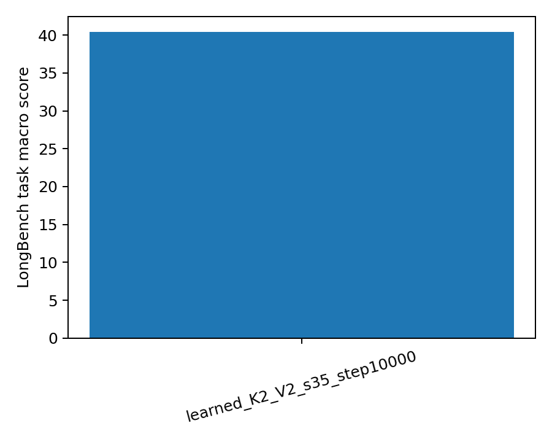
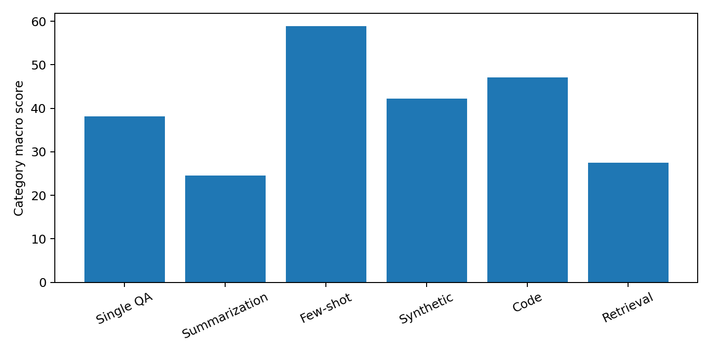
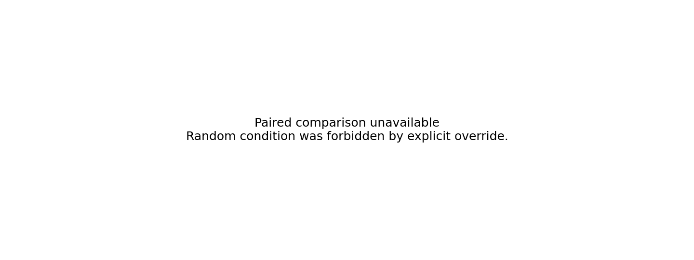

# LongBench learned K2/V2 step-10000 report

- Completion status: complete
- Predictions: 4750 rows
- Coverage: 21 tasks and 6 categories
- Learned task macro average: 40.426655
- Empty outputs/errors/non-finite scores: 0/0/0
- Key rotation tensor SHA-256: `824ac9f487464ed7837281b833bb7ce777e761fbbc66cdfa37cc125221af928b`
- Value rotation tensor SHA-256: `9a46e3b1758695a4a0cf5d5c43b369ac590dcef01ae623b90c0a9143f901d0ff`

## Comparison availability

Random was forbidden by the explicit learned-only override. Learned-minus-Random delta, confidence interval, and hypothesis verdict are unavailable and were not fabricated.

