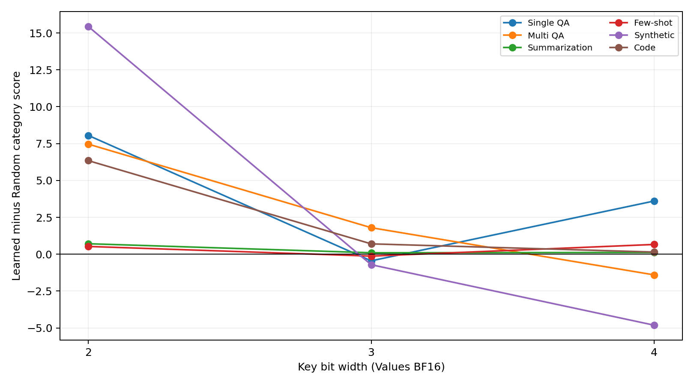
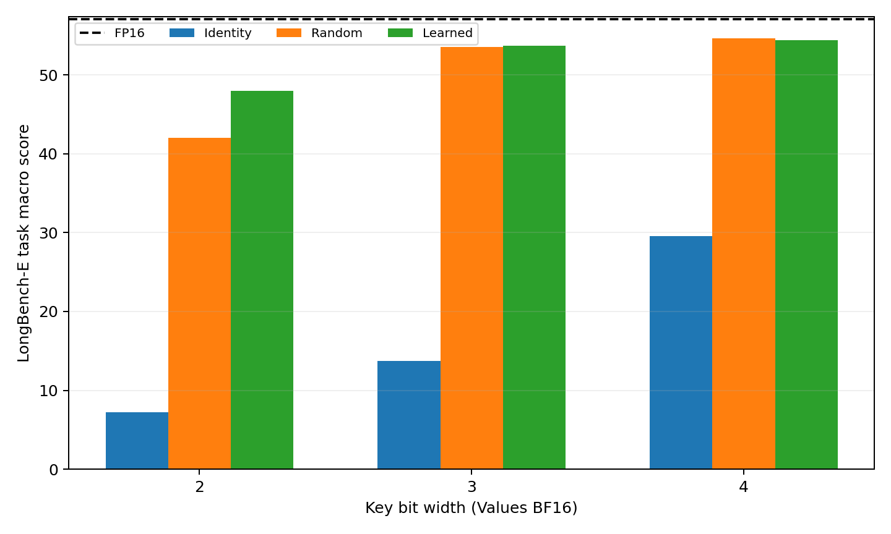
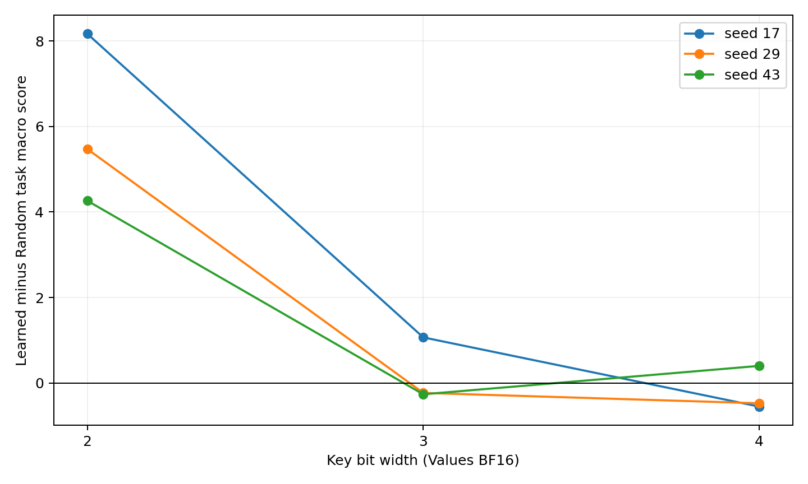

# Head-wise learned rotation: LongBench-E 195-example subset

Generated: 2026-08-15T05:07:55.313240+00:00

## Overall comparison

| Key bits | FP16 | Identity | Random mean | Learned mean | Learned vs Random | 95% CI | Seed wins | 8k+ difference | Verdict |
|---|---|---|---|---|---|---|---|---|---|
| 2 | 57.085 | 7.228 | 42.044 | 48.013 | +5.969 | [+3.177, +8.822] | 3/3 | +5.733 | Supported |
| 3 | 57.085 | 13.737 | 53.553 | 53.743 | +0.190 | [-2.052, +2.521] | 1/3 | -1.151 | Mixed |
| 4 | 57.085 | 29.551 | 54.656 | 54.447 | -0.209 | [-1.955, +1.553] | 1/3 | +0.742 | Not supported |

The 95% confidence intervals use paired, task-stratified example bootstrap with 10,000 resamples. Each bit width is judged independently.

## Category comparison

| Key bits | Method | Single QA | Multi QA | Summarization | Few-shot | Synthetic | Code | Average |
|---|---|---|---|---|---|---|---|---|
| 2 | fp16 | 53.019 | 53.444 | 28.401 | 73.259 | 56.667 | 69.633 | 57.085 |
| 2 | identity | 2.738 | 1.911 | 1.559 | 8.027 | 6.000 | 22.733 | 7.228 |
| 2 | random_mean | 33.997 | 28.905 | 26.252 | 65.935 | 35.000 | 50.233 | 42.044 |
| 2 | learned_mean | 42.052 | 36.369 | 26.960 | 66.459 | 50.440 | 56.578 | 48.013 |
| 3 | fp16 | 53.019 | 53.444 | 28.401 | 73.259 | 56.667 | 69.633 | 57.085 |
| 3 | identity | 12.189 | 4.793 | 11.145 | 27.752 | 5.000 | 14.533 | 13.737 |
| 3 | random_mean | 45.891 | 39.603 | 28.267 | 72.399 | 55.159 | 70.578 | 53.553 |
| 3 | learned_mean | 45.440 | 41.400 | 28.364 | 72.269 | 54.444 | 71.278 | 53.743 |
| 4 | fp16 | 53.019 | 53.444 | 28.401 | 73.259 | 56.667 | 69.633 | 57.085 |
| 4 | identity | 25.810 | 6.226 | 23.517 | 59.163 | 7.986 | 39.800 | 29.551 |
| 4 | random_mean | 47.308 | 44.008 | 28.350 | 72.373 | 59.074 | 67.967 | 54.656 |
| 4 | learned_mean | 50.914 | 42.605 | 28.467 | 73.033 | 54.259 | 68.111 | 54.447 |

## Per-task paired comparison

| Key bits | Task | Random mean | Learned mean | Difference | 95% CI | Wins |
|---|---|---|---|---|---|---|
| 2 | qasper | 30.528 | 44.696 | +14.168 | [-2.803, +30.002] | 3/3 |
| 2 | multifieldqa_en | 37.466 | 39.409 | +1.942 | [-3.415, +7.673] | 1/3 |
| 2 | hotpotqa | 29.840 | 37.667 | +7.827 | [-1.444, +18.333] | 2/3 |
| 2 | 2wikimqa | 27.971 | 35.071 | +7.100 | [-7.780, +23.141] | 2/3 |
| 2 | gov_report | 31.237 | 31.828 | +0.591 | [-1.907, +3.037] | 2/3 |
| 2 | multi_news | 21.266 | 22.092 | +0.826 | [-0.835, +2.398] | 2/3 |
| 2 | trec | 62.222 | 60.000 | -2.222 | [-17.778, +13.333] | 1/3 |
| 2 | triviaqa | 92.709 | 92.698 | -0.011 | [-6.294, +5.696] | 2/3 |
| 2 | samsum | 42.872 | 46.679 | +3.807 | [+0.112, +7.589] | 3/3 |
| 2 | passage_count | 4.444 | 15.324 | +10.880 | [+0.000, +21.991] | 3/3 |
| 2 | passage_retrieval_en | 65.556 | 85.556 | +20.000 | [+7.778, +32.222] | 2/3 |
| 2 | lcc | 53.156 | 56.222 | +3.067 | [-5.156, +10.978] | 2/3 |
| 2 | repobench-p | 47.311 | 56.933 | +9.622 | [+2.111, +17.423] | 3/3 |
| 3 | qasper | 53.036 | 52.416 | -0.620 | [-13.837, +12.229] | 1/3 |
| 3 | multifieldqa_en | 38.745 | 38.464 | -0.281 | [-3.685, +3.106] | 2/3 |
| 3 | hotpotqa | 40.025 | 38.012 | -2.012 | [-9.506, +4.506] | 1/3 |
| 3 | 2wikimqa | 39.181 | 44.787 | +5.606 | [-9.778, +21.902] | 3/3 |
| 3 | gov_report | 33.988 | 34.094 | +0.106 | [-0.607, +0.855] | 1/3 |
| 3 | multi_news | 22.547 | 22.633 | +0.086 | [-0.389, +0.600] | 2/3 |
| 3 | trec | 75.556 | 73.333 | -2.222 | [-13.333, +8.889] | 0/3 |
| 3 | triviaqa | 91.082 | 93.862 | +2.780 | [-2.434, +11.515] | 2/3 |
| 3 | samsum | 50.560 | 49.611 | -0.949 | [-4.682, +2.204] | 1/3 |
| 3 | passage_count | 16.984 | 13.333 | -3.651 | [-13.056, +5.516] | 1/3 |
| 3 | passage_retrieval_en | 93.333 | 95.556 | +2.222 | [+0.000, +6.667] | 1/3 |
| 3 | lcc | 76.289 | 77.711 | +1.422 | [-2.800, +6.556] | 2/3 |
| 3 | repobench-p | 64.867 | 64.844 | -0.022 | [-8.400, +8.689] | 1/3 |
| 4 | qasper | 57.595 | 62.672 | +5.077 | [-2.346, +12.816] | 3/3 |
| 4 | multifieldqa_en | 37.021 | 39.155 | +2.134 | [+0.195, +4.523] | 2/3 |
| 4 | hotpotqa | 43.049 | 41.116 | -1.933 | [-13.521, +7.333] | 1/3 |
| 4 | 2wikimqa | 44.967 | 44.094 | -0.874 | [-12.095, +12.515] | 1/3 |
| 4 | gov_report | 34.309 | 34.397 | +0.088 | [-1.031, +1.235] | 2/3 |
| 4 | multi_news | 22.391 | 22.538 | +0.147 | [-0.871, +1.073] | 2/3 |
| 4 | trec | 73.333 | 73.333 | +0.000 | [+0.000, +0.000] | 0/3 |
| 4 | triviaqa | 92.698 | 94.921 | +2.222 | [+0.000, +6.667] | 1/3 |
| 4 | samsum | 51.088 | 50.844 | -0.244 | [-2.102, +1.420] | 1/3 |
| 4 | passage_count | 24.815 | 15.185 | -9.630 | [-21.481, +1.852] | 1/3 |
| 4 | passage_retrieval_en | 93.333 | 93.333 | +0.000 | [+0.000, +0.000] | 0/3 |
| 4 | lcc | 76.378 | 76.889 | +0.511 | [-2.000, +3.289] | 2/3 |
| 4 | repobench-p | 59.556 | 59.333 | -0.222 | [-6.334, +4.911] | 2/3 |

## Protocol notes

- Model revision: `d10aef7999a2b5ba950ab3974312feeedbfe0b77`.
- LongBench commit: `2e00731f8d0bff23dc4325161044d0ed8af94c1e`.
- LongBench dataset revision: `5e628be450b7e67fb7ae6e201bd6d8f7056f7672`.
- Subset seed: `20020305`; exactly 5 examples per task and length interval.
- Evaluated examples per condition: 195 across 13 tasks.
- Precision labels are K16/V16, K2/V16, K3/V16, and K4/V16. Values remain BF16 in every condition.
- Quantized conditions emulate packed key-cache quality by quantizing and reconstructing every pre-RoPE key before BF16 cache storage. Values remain BF16. Reported KV bytes/token are theoretical; measured GPU peaks reflect the unfused emulation.
- LongBench-E was not used for rotation training, model selection, or hyperparameter selection.

